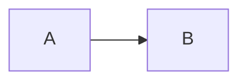
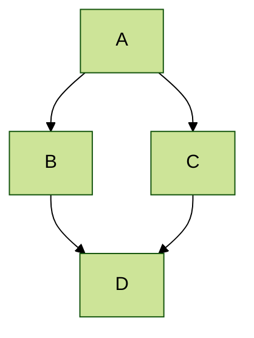

# Academic Pages
**Academic Pages is a GitHub Pages template for personal and professional portfolio-oriented websites.**


# Getting Started

1. Register a GitHub account if you don't have one and confirm your e-mail (required!)
1. Click the "Use this template" button in the top right.
1. On the "New repository" page, enter your public repository name as "[your GitHub username].github.io", which will also be your website's URL.
1. Set site-wide configuration and add your content.
1. Upload any files (like PDFs, .zip files, etc.) to the `files/` directory. They will appear at https://[your GitHub username].github.io/files/example.pdf.
1. Check status by going to the repository settings, in the "GitHub pages" section
1. (Optional) Use the Jupyter notebooks or python scripts in the `markdown_generator` folder to generate markdown files for publications and talks from a TSV file.

See more info at https://academicpages.github.io/

## Running locally

When you are initially working on your website, it is very useful to be able to preview the changes locally before pushing them to GitHub. To work locally you will need to:

1. Clone the repository and made updates as detailed above.

### Using a different IDE
1. Make sure you have ruby-dev, bundler, and nodejs installed
    
    On most Linux distribution and [Windows Subsystem Linux](https://learn.microsoft.com/en-us/windows/wsl/about) the command is:
    ```bash
    sudo apt install ruby-dev ruby-bundler nodejs
    ```
    If you see error `Unable to locate package ruby-bundler`, `Unable to locate package nodejs `, run the following:
    ```bash
    sudo apt update && sudo apt upgrade -y
    ```
    then try run `sudo apt install ruby-dev ruby-bundler nodejs` again.

    On MacOS the commands are:
    ```bash
    brew install ruby
    brew install node
    gem install bundler
    ```
1. Run `bundle install` to install ruby dependencies. If you get errors, delete Gemfile.lock and try again.

    If you see file permission error like `Fetching bundler-2.6.3.gem ERROR:  While executing gem (Gem::FilePermissionError) You don't have write permissions for the /var/lib/gems/3.2.0 directory.` or `Bundler::PermissionError: There was an error while trying to write to /usr/local/bin.`
    Install Gems Locally (Recommended):
    ```bash
    bundle config set --local path 'vendor/bundle'
    ```
    then try run `bundle install` again. If succeeded, you should see a folder called `vendor` and `.bundle`.

1. Run `jekyll serve -l -H localhost` to generate the HTML and serve it from `localhost:4000` the local server will automatically rebuild and refresh the pages on change to Markdown (*.md) and HTML files, while changes to the core template and configuration (i.e., `_config.yml`) will require stoping and restarting Jekyll.
    You may also try `bundle exec jekyll serve -l -H localhost` to ensure jekyll to use specific dependencies on your own local machine.

If you are running on Linux it may be necessary to install some additional dependencies prior to being able to run locally: `sudo apt install build-essential gcc make`

## Using Docker

Working from a different OS, or just want to avoid installing dependencies? You can use the provided `Dockerfile` to build a container that will run the site for you if you have [Docker](https://www.docker.com/) installed.

You can build and execute the container by running the following command in the repository:

```bash
chmod -R 777 .
docker compose up
```

You should now be able to access the website from `localhost:4000`.

### Using the DevContainer in VS Code

If you are using [Visual Studio Code](https://code.visualstudio.com/) you can use the [Dev Container](https://code.visualstudio.com/docs/devcontainers/containers) that comes with this Repository. Normally VS Code detects that a development coontainer configuration is available and asks you if you want to use the container. If this doesn't happen you can manually start the container by **F1->DevContainer: Reopen in Container**. This restarts your VS Code in the container and automatically hosts your academic page locally on http://localhost:4000. All changes will be updated live to that page after a few seconds.

# Maintenance

Bug reports and feature requests to the template should be [submitted via GitHub](https://github.com/academicpages/academicpages.github.io/issues/new/choose). For questions concerning how to style the template, please feel free to start a [new discussion on GitHub](https://github.com/academicpages/academicpages.github.io/discussions).

This repository was forked (then detached) by [Stuart Geiger](https://github.com/staeiou) from the [Minimal Mistakes Jekyll Theme](https://mmistakes.github.io/minimal-mistakes/), which is © 2016 Michael Rose and released under the MIT License (see LICENSE.md). It is currently being maintained by [Robert Zupko](https://github.com/rjzupkoii) and additional maintainers would be welcomed.

## Bugfixes and enhancements

If you have bugfixes and enhancements that you would like to submit as a pull request, you will need to [fork](https://docs.github.com/en/pull-requests/collaborating-with-pull-requests/working-with-forks/fork-a-repo) this repository as opposed to using it as a template. This will also allow you to [synchronize your copy](https://docs.github.com/en/pull-requests/collaborating-with-pull-requests/working-with-forks/syncing-a-fork) of template to your fork as well.

Unfortunately, one logistical issue with a template theme like Academic Pages that makes it a little tricky to get bug fixes and updates to the core theme. If you use this template and customize it, you will probably get merge conflicts if you attempt to synchronize. If you want to save your various .yml configuration files and markdown files, you can delete the repository and fork it again. Or you can manually patch.

---
<div align="center">
    

[](https://github.com/academicpages/academicpages.github.io/graphs/contributors)
[](https://github.com/academicpages/academicpages.github.io/releases/latest)
[](https://github.com/academicpages/academicpages.github.io/blob/master/LICENSE)

[](https://github.com/academicpages/academicpages.github.io)
[](https://github.com/academicpages/academicpages.github.io/fork)
</div>




## Locations of key files/directories

* Basic config options: _config.yml
* Top navigation bar config: _data/navigation.yml
* Single pages: _pages/
* Collections of pages are .md or .html files in:
  * _publications/
  * _portfolio/
  * _posts/
  * _teaching/
  * _talks/
* Footer: _includes/footer.html
* Static files (like PDFs): /files/
* Profile image (can set in _config.yml): images/profile.png

## Tips and hints

* Name a file ".md" to have it render in markdown, name it ".html" to render in HTML.
* Go to the [commit list](https://github.com/academicpages/academicpages.github.io/commits/master) (on your repo) to find the last version GitHub built with Jekyll. 
  * Green check: successful build
  * Orange circle: building
  * Red X: error
  * No icon: not built

* Academic Pages uses [Jekyll Kramdown](https://jekyllrb.com/docs/configuration/markdown/), GitHub Flavored Markdown (GFM) parser, which is similar to the version of Markdown used on GitHub, but may have some minor differences. 
  * Some of emoji supported on GitHub should be supposed via the [Jemoji](https://github.com/jekyll/jemoji) plugin :computer:.
  * The best list of the supported emoji can be found in the [Emojis for Jekyll via Jemoji](https://www.fabriziomusacchio.com/blog/2021-08-16-emojis_for_Jekyll/#computer) blog post.

* While GitHub Pages prevents server side code from running, client-side scripts are supported.
  * This means that Google Analytics is supported, and [the wiki](https://github.com/academicpages/academicpages.github.io/wiki/Adding-Google-Analytics) should contain the most up-to-date information on getting it working.

* Your CV can be written using either Markdown ([preview](https://academicpages.github.io/cv/)) or generated via JSON ([preview](https://academicpages.github.io/cv-json/)) and the layouts are slightly different. You can update the path to the one being used in `_data/navigation.yml` with the JSON formatted CV being hidden by default.

 * The [Liquid syntax guide](https://shopify.github.io/liquid/tags/control-flow/) is a useful guide for those that want to add functionality to the template or to become contributors to the [template on GitHub](https://github.com/academicpages/academicpages.github.io).

## MathJax 

Support for MathJax (version 3.* via [jsDelivr](https://www.jsdelivr.com/), [documentation](https://docs.mathjax.org/en/latest/)) is included in the template:

$$
\displaylines{
\nabla \cdot E= \frac{\rho}{\epsilon_0} \\\
\nabla \cdot B=0 \\\
\nabla \times E= -\partial_tB \\\
\nabla \times B  = \mu_0 \left(J + \varepsilon_0 \partial_t E \right)
}
$$

The default delimiters of `$$...$$` and `\\[...\\]` are supported for displayed mathematics, while `\\(...\\)` should be used for in-line mathematics (ex., \\(a^2 + b^2 = c^2\\))

**Note** that since Academic Pages uses Markdown which cases some interference with MathJax and LaTeX for escaping characters and new lines, although [some workarounds exist](https://math.codidact.com/posts/278763/278772#answer-278772). In some cases, such as when you are including MathJax in a `citation` field for publications, it may be necessary to use `\(...\)` for inline delineation.

## Mermaid diagrams
Academic Pages includes support for [Mermaid diagrams](https://mermaid.js.org/) (version 11.* via [jsDelivr](https://www.jsdelivr.com/)) and in addition to their [tutorials](https://mermaid.js.org/ecosystem/tutorials.html) and [GitHub documentation](https://github.com/mermaid-js/mermaid) the basic syntax is as follows:

```markdown
    ```mermaid
    graph LR
    A-->B
    ```
```

Which produces the following plot with the [default theme](https://mermaid.js.org/config/theming.html) applied:



While a more advanced plot with the `forest` theme applied looks like the following:



## Plotly
Academic Pages includes support for Plotly diagrams via a hook in the Markdown code elements, although those that are comfortable with HTML and JavaScript can also access it [via those routes](https://plotly.com/javascript/getting-started/).

In order to render a Plotly plot via Markdown the relevant plot data need to be added as follows:

```markdown
    ```plotly
    {
      "data": [
        {
          "x": [1, 2, 3, 4],
          "y": [10, 15, 13, 17],
          "type": "scatter"
        },
        {
          "x": [1, 2, 3, 4],
          "y": [16, 5, 11, 9],
          "type": "scatter"
        }
      ]
    }
    ```
```

**Important!** Since the data is parsed as JSON *all* of the keys will need to be quoted for the plot to render. The use of a tool like [JSONLint](https://jsonlint.com/) to check syntax is highly recommended.
{: .notice}

Which produces the following:
```plotly
{
  "data": [
    {
      "x": [1, 2, 3, 4],
      "y": [10, 15, 13, 17],
      "type": "scatter"
    },
    {
      "x": [1, 2, 3, 4],
      "y": [16, 5, 11, 9],
      "type": "scatter"
    }
  ]
}
```

Essentially what is taking place is that the [Plotly attributes](https://plotly.com/javascript/reference/index/) are being taken from the code block as JSON data, parsed, and passed to Plotly along with a theme that matches the current site theme (i.e., a light theme, or a dark theme). This allows all plots that can be described via the `data` attribute to rendered with some limitations for the theme of the plot.

```plotly
{
  "data": [
    {
      "x": [1, 2, 3, 4, 5],
      "y": [1, 6, 3, 6, 1],
      "mode": "markers",
      "type": "scatter",
      "name": "Team A",
      "text": ["A-1", "A-2", "A-3", "A-4", "A-5"],
      "marker": { "size": 12 }
    },
    {
      "x": [1.5, 2.5, 3.5, 4.5, 5.5],
      "y": [4, 1, 7, 1, 4],
      "mode": "markers",
      "type": "scatter",
      "name": "Team B",
      "text": ["B-a", "B-b", "B-c", "B-d", "B-e"],
      "marker": { "size": 12 }
    }    
  ],
  "layout": {
    "xaxis": {
      "range": [ 0.75, 5.25 ]
    },
    "yaxis": {
      "range": [0, 8]
    },
    "title": {"text": "Data Labels Hover"}
  }
}
```

```plotly
{
  "data": [{
      "x": [1, 2, 3],
      "y": [4, 5, 6],
      "type": "scatter"
    },
    {
      "x": [20, 30, 40],
      "y": [50, 60, 70],
      "xaxis": "x2",
      "yaxis": "y2",
      "type": "scatter"
  }],
  "layout": {
    "grid": {
      "rows": 1,
      "columns": 2,
      "pattern": "independent"
    },
    "title": {
      "text": "Simple Subplot"
    }    
  }
}
```

```plotly
{
  "data": [{
		"z": [[10, 10.625, 12.5, 15.625, 20],
          [5.625, 6.25, 8.125, 11.25, 15.625],
          [2.5, 3.125, 5.0, 8.125, 12.5],
          [0.625, 1.25, 3.125, 6.25, 10.625],
          [0, 0.625, 2.5, 5.625, 10]],
		"type": "contour"
	}],
  "layout": {
    "title": {
      "text": "Basic Contour Plot"
    }
  }
}
```

## Markdown guide

Academic Pages uses [kramdown](https://kramdown.gettalong.org/index.html) for Markdown rendering, which has some differences from other Markdown implementations such as GitHub's. In addition to this guide, please see the [kramdown Syntax page](https://kramdown.gettalong.org/syntax.html) for full documentation.  

### Header three

#### Header four

##### Header five

###### Header six

## Blockquotes

Single line blockquote:

> Quotes are cool.

## Tables

### Table 1

| Entry            | Item   |                                                              |
| --------         | ------ | ------------------------------------------------------------ |
| [John Doe](#)    | 2016   | Description of the item in the list                          |
| [Jane Doe](#)    | 2019   | Description of the item in the list                          |
| [Doe Doe](#)     | 2022   | Description of the item in the list                          |

### Table 2

| Header1 | Header2 | Header3 |
|:--------|:-------:|--------:|
| cell1   | cell2   | cell3   |
| cell4   | ce
ll5   | cell6   |
|-----------------------------|
| cell1   | cell2   | cell3   |
| cell4   | cell5   | cell6   |
|=============================|
| Foot1   | Foot2   | Foot3   |

## Definition Lists

Definition List Title
:   Definition list division.

Startup
:   A startup company or startup is a company or temporary organization designed to search for a repeatable and scalable business model.

#dowork
:   Coined by Rob Dyrdek and his personal body guard Christopher "Big Black" Boykins, "Do Work" works as a self motivator, to motivating your friends.

Do It Live
:   I'll let Bill O'Reilly [explain](https://www.youtube.com/watch?v=O_HyZ5aW76c "We'll Do It Live") this one.

## Unordered Lists (Nested)

  * List item one 
      * List item one 
          * List item one
          * List item two
          * List item three
          * List item four
      * List item two
      * List item three
      * List item four
  * List item two
  * List item three
  * List item four

## Ordered List (Nested)

  1. List item one 
      1. List item one 
          1. List item one
          2. List item two
          3. List item three
          4. List item four
      2. List item two
      3. List item three
      4. List item four
  2. List item two
  3. List item three
  4. List item four

## Buttons

Make any link standout more when applying the `.btn` class.

## Notices

Basic notices or call-outs are supported using the following syntax:

```markdown
**Watch out!** You can also add notices by appending `{: .notice}` to the line following paragraph.
{: .notice}
```

which wil render as:

**Watch out!** You can also add notices by appending `{: .notice}` to the line following paragraph.
{: .notice}

### Footnotes

Footnotes can be useful for clarifying points in the text, or citing information.[^1] Markdown support numeric footnotes, as well as text as long as the values are unique.[^note]

```markdown
This is the regular text.[^1] This is more regular text.[^note]

[^1]: This is the footnote itself.
[^note]: This is another footnote.
```

[^1]: Such as this footnote.
[^note]: When using text for footnotes markers, no spaces are permitted in the name.

## HTML Tags

### Address Tag

<address>
  1 Infinite Loop<br /> Cupertino, CA 95014<br /> United States
</address>

### Anchor Tag (aka. Link)

This is an example of a [link](https://github.com "GitHub").

### Abbreviation Tag

The abbreviation CSS stands for "Cascading Style Sheets".

*[CSS]: Cascading Style Sheets

### Cite Tag

"Code is poetry." ---<cite>Automattic</cite>

### Code Tag

You will learn later on in these tests that `word-wrap: break-word;` will be your best friend.

You can also write larger blocks of code with syntax highlighting supported for some languages, such as Python:

```python
print('Hello World!')
```

or R:

```R
print("Hello World!", quote = FALSE)
```

### Details Tag (collapsible sections)

The HTML `<details>` tag works well with Markdown and allows you to include collapsible sections, see [W3Schools](https://www.w3schools.com/tags/tag_details.asp) for more information on how to use the tag.

<details>
  <summary>Collapsed by default</summary>
  This section was collapsed by default!
</details>

The source code:

```HTML
<details>
  <summary>Collapsed by default</summary>
  This section was collapsed by default!
</details>
```

Or, you can leave a section open by default by including the `open` attribute in the tag:

<details open>
  <summary>Open by default</summary>
  This section is open by default thanks to open in the &lt;details open&gt; tag!
</details>


### Emphasize Tag

The emphasize tag should _italicize_ text.

### Insert Tag

This tag should denote <ins>inserted</ins> text.

### Keyboard Tag

This scarcely known tag emulates <kbd>keyboard text</kbd>, which is usually styled like the `<code>` tag.

### Preformatted Tag

This tag styles large blocks of code.

<pre>
.post-title {
  margin: 0 0 5px;
  font-weight: bold;
  font-size: 38px;
  line-height: 1.2;
  and here's a line of some really, really, really, really long text, just to see how the PRE tag handles it and to find out how it overflows;
}
</pre>

### Quote Tag

<q>Developers, developers, developers&#8230;</q> &#8211;Steve Ballmer

### Strike Tag

This tag will let you <strike>strikeout text</strike>.

### Strong Tag

This tag shows **bold text**.

### Subscript Tag

Getting our science styling on with H<sub>2</sub>O, which should push the "2" down.

### Superscript Tag

Still sticking with science and Isaac Newton's E = MC<sup>2</sup>, which should lift the 2 up.

### Variable Tag

This allows you to denote <var>variables</var>.

***
**Footnotes**

The footnotes in the page will be returned following this line, return to the section on <a href="#footnotes">Markdown Footnotes</a>.

